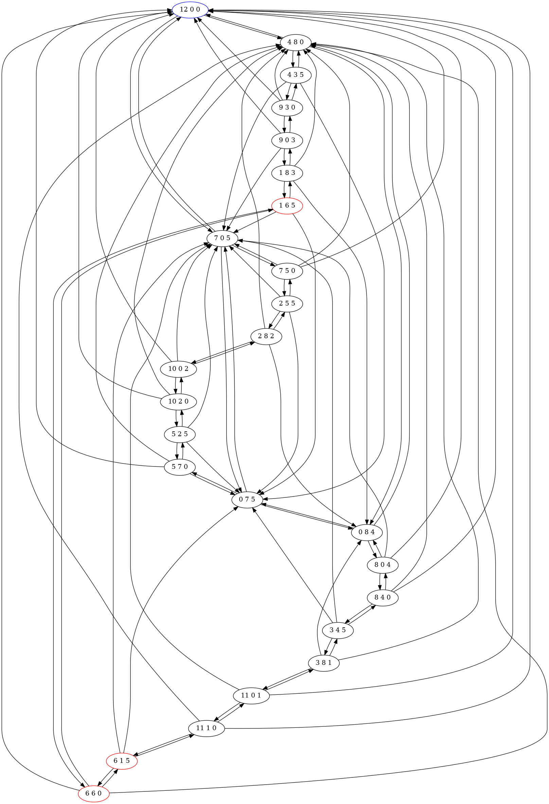

# The 3 Jugs Riddle

## Problem
You have a full 12 liter jug and empty 5 and 8 liter jugs. Can you measure exactly 6 liters? This problem dates to 1484 and was posed in the context of a milkman making a home delivery to a customer.

Inspired by: [MindYourDecisions - The 3 Jugs Riddle](https://www.youtube.com/watch?v=9fZB4s38Ygg)

## Solution

Created by Simon Karman